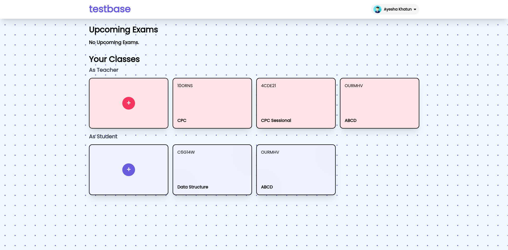
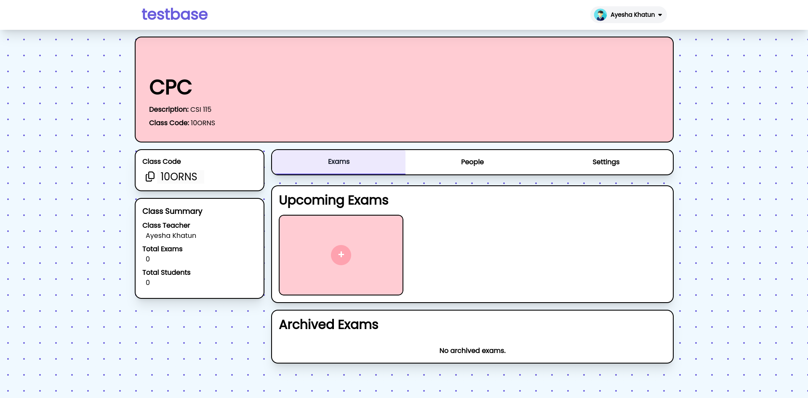

# testbase

An online Exam Platform created with Django


## Run Locally

Clone the project

```bash
  git clone https://github.com/fardeenes7/testbase
```

Go to the project directory

```bash
  cd testbase
```

Create and activate virtual environment
```bash
  python -m venv venv
  source venv/bin/activate
```

Install dependencies

```bash
  pip install -r requirements.txt
```

Start the server

```bash
  python manage.py runserver
```

N.B: Migrations are already done in the local sqlite database.


## Screenshots







